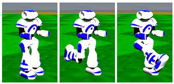
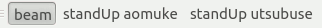
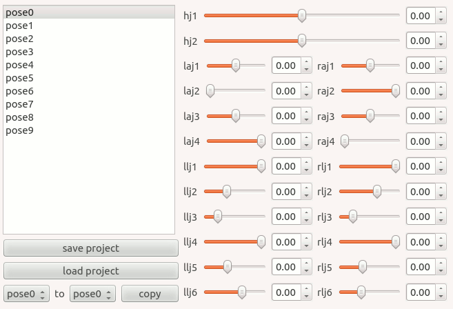
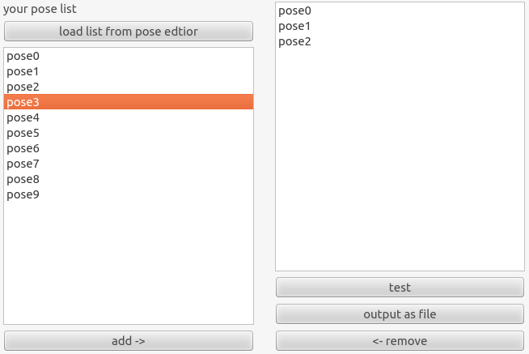

#使い方
##概要
このモーションエディタでは、ロボットの動きの中でも  
いくつかのポーズを順番に組み合わせることで表現できる動作を作ることができます。

例えば「蹴る」動作は「立つ→足を後ろへ振り上げる→前へ蹴り出す」という  
3つのポーズの組み合わせで表すことができます。  

このツールでは組み合わせるべきひとつひとつのポーズを作り、  
それらを順番にテストさせることができます。  
また、出来上がった動作を試合用ソースへ移す際のc++コード片を出力することができます。  

##GUIWindow解説
###ツールバー

ツールバーには現在3つのボタンが用意してあります。  
beamは試合前の初期配置用のコマンドを利用し、ロボットの位置を固定することができます。  
実際に転んでしまうかどうかなどを確認する際はチェックを外して下さい。  
2つのstandUpボタンはそれぞれ仰向け・うつ伏せに転んでしまった時に立ち上がる動作をさせるためのボタンです。

###ポーズエディタ
  
ポーズエディタタブは、組み合わせるポーズひとつひとつを作成するためのGUIです。  
右側のスライダー群を動かすことで、ロボットの関節角を指定することができます。  
左にあるpose0からpose9までのリストは、ポーズの保存領域です。  
左下のコピーボタンを使用することである保存領域から別の保存領域へ指定した角度をコピーすることもできます。  

###シーケンスエディタ
  
シーケンスエディタタブでは、ポーズエディタタブにて作成したポーズを  
どの順番で組み合わせるのかを指定することができます。  
最初に「load list from pose editor」ボタンを押してポーズエディタから保存してある10個のポーズを読み込んで下さい。  
その後は下辺にある「add」「remove」の二つのボタンを使って右のリストへポーズを順番に並べて下さい。  
「test」ボタンでサーバーに接続しているエージェントに動作させて見ることもできます。  
また、「output as file」ボタンではc++ソースコード片を出力することができます。  

###試合用ソースへの移植
シーケンスエディタで出力したソース片は、hillstoneUnitedの試合用ソースへ移植することができます。  
(hillstoneUnitedについては<http://hillstoneunited.github.com/hillstoneUnited>をご覧下さい)  

「順番にポーズを繰り出すタイプの動作」について記述してあるのは  
hillstoneUnited/movement/sequencemovement.cppです。  
`void SequenceMovement::setNewSequence(std::string name)`関数は、文字列と「どのポーズをどの順番で繰り出すか(Sequenceクラス)」を関連付けます。  
エディタが出力するのは、このSequenceクラスを作成するためのコードです。
関数内のif文の分岐を増やし、分岐内へエディタの出力したコードをコピーして下さい。
